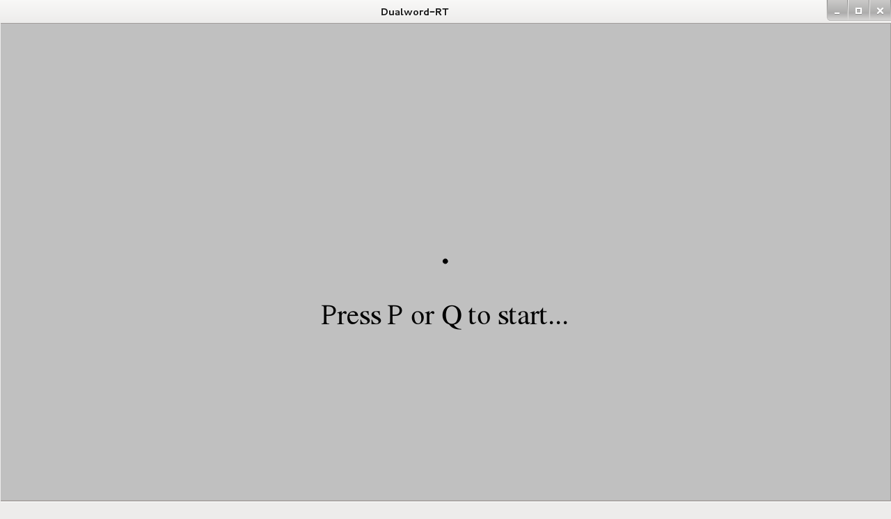
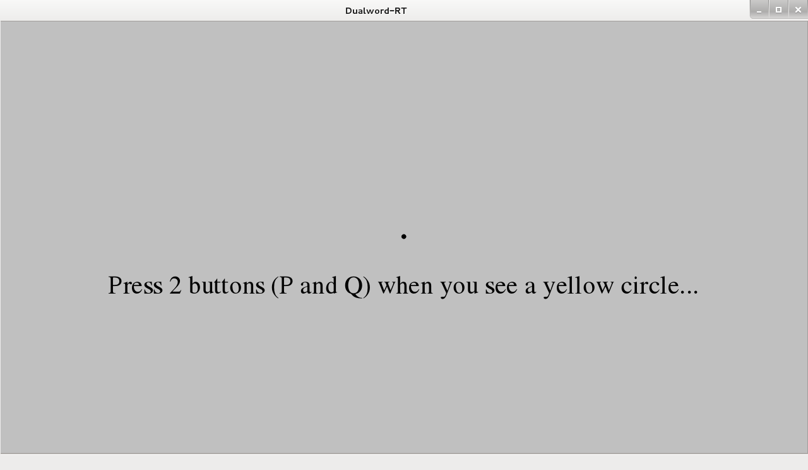
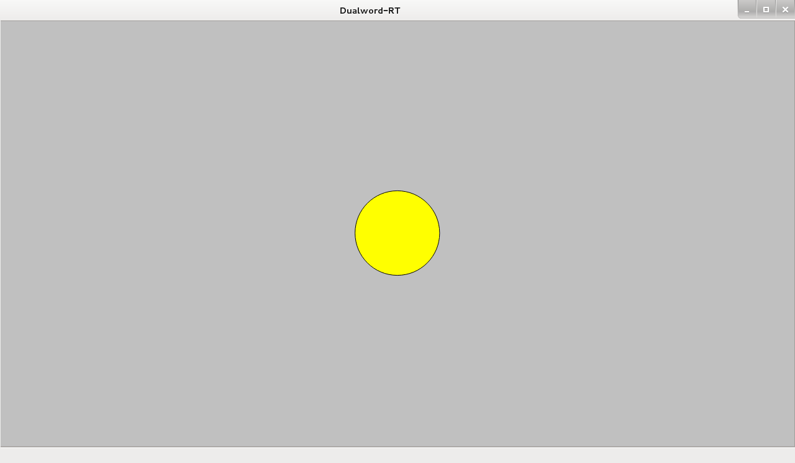
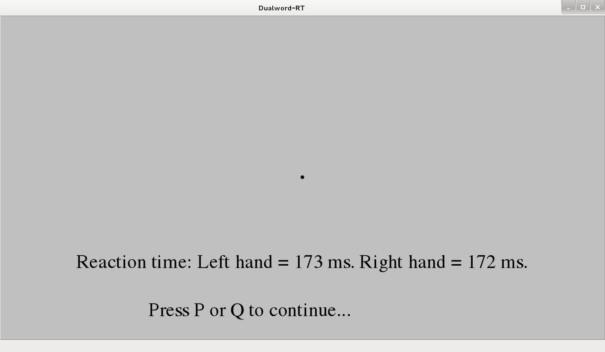

DualWord-RT - open-source cross-platform computer program for measuring 
bimanual simple visual reaction time.  

Third Party Software:
	-Qt 4.8.5      license:LGPL v2.1  

License: GNU GENERAL PUBLIC LICENSE Version 3  
Source code: http://github.com/dualword/dualword-rt  

&nbsp;
&nbsp; 
&nbsp;
&nbsp; 

